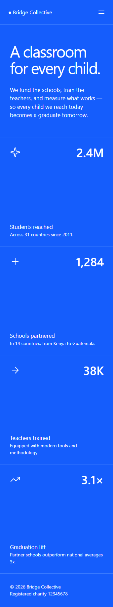
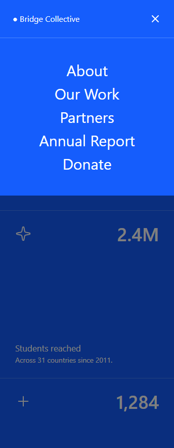
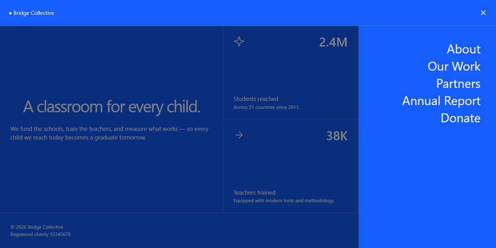

# Frontend Mentor - Grid landing page solution

This is a solution to the [Grid landing page challenge on Frontend Mentor](https://www.frontendmentor.io/challenges/grid-landing-page). Frontend Mentor challenges help you improve your coding skills by building realistic projects. 

## Table of contents

- [Frontend Mentor - Grid landing page solution](#frontend-mentor---grid-landing-page-solution)
  - [Table of contents](#table-of-contents)
  - [Overview](#overview)
    - [The challenge](#the-challenge)
    - [Screenshot](#screenshot)
    - [Links](#links)
  - [My process](#my-process)
    - [Built with](#built-with)
    - [What I learned](#what-i-learned)
    - [Continued development](#continued-development)
    - [Useful resources](#useful-resources)
    - [AI Collaboration](#ai-collaboration)
  - [Author](#author)
  - [Acknowledgments](#acknowledgments)
- [React + TypeScript + Vite](#react--typescript--vite)
  - [React Compiler](#react-compiler)
  - [Expanding the ESLint configuration](#expanding-the-eslint-configuration)

## Overview

### The challenge

Users should be able to:

- View the optimal layout for the page depending on their device's screen size
- See hover and focus states for all interactive elements on the page
- Open and close the navigation menu at any screen size (optional JavaScript)

### Screenshot

Mobile:

 

Tablet:

 

Desktop:

  

### Links

- Solution URL: [https://github.com/yoranguy/frontendmentor-016-gridlandingpage/tree/main/frontend](https://github.com/yoranguy/frontendmentor-016-gridlandingpage/tree/main/frontend)
- Live Site URL: [https://yoranguy-frontendmentor-grid.vercel.app/](https://yoranguy-frontendmentor-grid.vercel.app/)

## My process

### Built with

- Semantic HTML5 markup
- CSS custom properties
- Flexbox
- CSS Grid
- Mobile-first workflow
- [React](https://reactjs.org/) - JS library
- [Tailwindcss](http:tailwindcss.com/doc) - For styles

### What I learned

Use this section to recap over some of your major learnings while working through this project. Writing these out and providing code samples of areas you want to highlight is a great way to reinforce your own knowledge.

To see how you can add code snippets, see below:

```html
<h1>Some HTML code I'm proud of</h1>
```
```css
.proud-of-this-css {
  color: papayawhip;
}
```
```js
const proudOfThisFunc = () => {
  console.log('🎉')
}
```

If you want more help with writing markdown, we'd recommend checking out [The Markdown Guide](https://www.markdownguide.org/) to learn more.

**Note: Delete this note and the content within this section and replace with your own learnings.**


- **Folder Structure** included new folders to keep attempt to keep everything organised:
  - hooks
  - components
  - pages
Note: I am not sure if this is the correct way forward

- Using **Router**, **Routes**, **Route**
  - This was the first time doing this myself, I did have trouble at first but it was due to css.


### Continued development

The following topics are continuiously being used:

- **HTML Semantics**
- **Responsiveness**
- **React: components, props, interfaces**
- **Javascript**: onClick(), functions
- **CSS**: flex, grid

### Useful resources

- [Tailwindcss](https://tailwindcss.com/doc) - CSS Framework Styling


### AI Collaboration

I did use google a lot more this time to help with debugging.

## Author

- Linktree - [https://linktr.ee/yoranguy](https://linktr.ee/yoranguy)
- Frontend Mentor - [@yoranguy](https://www.frontendmentor.io/profile/yoranguy)
- Github - [@yoranguy](https://github.com/yoranguy)

## Acknowledgments

Phong Nguyen for some initial Feedback

# React + TypeScript + Vite

This template provides a minimal setup to get React working in Vite with HMR and some ESLint rules.

Currently, two official plugins are available:

- [@vitejs/plugin-react](https://github.com/vitejs/vite-plugin-react/blob/main/packages/plugin-react) uses [Oxc](https://oxc.rs)
- [@vitejs/plugin-react-swc](https://github.com/vitejs/vite-plugin-react/blob/main/packages/plugin-react-swc) uses [SWC](https://swc.rs/)

## React Compiler

The React Compiler is not enabled on this template because of its impact on dev & build performances. To add it, see [this documentation](https://react.dev/learn/react-compiler/installation).

## Expanding the ESLint configuration

If you are developing a production application, we recommend updating the configuration to enable type-aware lint rules:

```js
export default defineConfig([
  globalIgnores(['dist']),
  {
    files: ['**/*.{ts,tsx}'],
    extends: [
      // Other configs...

      // Remove tseslint.configs.recommended and replace with this
      tseslint.configs.recommendedTypeChecked,
      // Alternatively, use this for stricter rules
      tseslint.configs.strictTypeChecked,
      // Optionally, add this for stylistic rules
      tseslint.configs.stylisticTypeChecked,

      // Other configs...
    ],
    languageOptions: {
      parserOptions: {
        project: ['./tsconfig.node.json', './tsconfig.app.json'],
        tsconfigRootDir: import.meta.dirname,
      },
      // other options...
    },
  },
])

```

You can also install [eslint-plugin-react-x](https://npmx.dev/package/eslint-plugin-react-x) and [eslint-plugin-react-dom](https://npmx.dev/package/eslint-plugin-react-dom) for React-specific lint rules:

```js
// eslint.config.js
import reactX from 'eslint-plugin-react-x'
import reactDom from 'eslint-plugin-react-dom'

export default defineConfig([
  globalIgnores(['dist']),
  {
    files: ['**/*.{ts,tsx}'],
    extends: [
      // Other configs...
      // Enable lint rules for React
      reactX.configs['recommended-typescript'],
      // Enable lint rules for React DOM
      reactDom.configs.recommended,
    ],
    languageOptions: {
      parserOptions: {
        project: ['./tsconfig.node.json', './tsconfig.app.json'],
        tsconfigRootDir: import.meta.dirname,
      },
      // other options...
    },
  },
])

```
